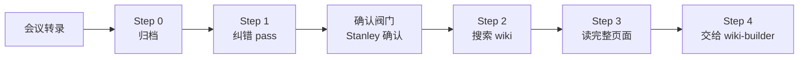
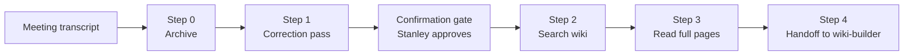

# meeting-ingest · 会议转录入库

[中文](#中文) | [English](#english)

---

## 中文

把语音转文字的会议记录，先做可追溯纠错，再对照 wiki 判断哪些内容值得长期入库，最后交给 wiki-builder 按知识库规范写回。

### 它解决什么问题

语音转录的会议记录通常有三个痛点：

1. 人名、产品名、医院名、组织名、术语和缩写容易被 ASR 错写。
2. 同一场会议里常混有已知信息、新信号、执行细节和临时讨论。
3. 如果错误转录直接进入 wiki，会污染后续 RO 文档、判断和检索结果。

meeting-ingest 的边界很清楚：它负责会议转录的纠错、wiki 对照和写回前准备；结构化写回交给 wiki-builder。



### 核心能力

- 说话人实名化：按参会人、点名顺序、会议结构和 wiki people/ 逐段确认，不把 ASR 发言人编号当成稳定身份。
- 内容纠错：对人名、产品名、组织名、医院名、术语、缩写、日期、金额、数量等高风险字段做证据化校正。
- 确认阀门：改写转录文件前必须先展示纠错表，只有 Stanley 确认“改”的项目才写回。
- TARS 例外：raw/meetings/ 中由 ASR 生成的会议纪要/逐字稿可以被纠错改写；此例外不扩展到 raw/ 下其他原始来源。
- wiki 对照：搜索并完整阅读相关 wiki 页面，避免只凭 snippet 判断“已知”。

### 快速开始

将 skill 放入你的 agent skill 目录，例如：

```bash
git clone https://github.com/stanley6635/meeting-ingest.git ~/.claude/skills/meeting-ingest
```

然后按 [SETUP.md](SETUP.md) 配置 `$MEETINGS_DIR`、`$WIKI_DIR` 和 `$INDEX_FILE`。

### 依赖

- 结构化 wiki 知识库
- `file-ingest` skill：用于归档会议转录
- `pro-workflow:wiki-builder`：用于最终 wiki 写回
- agentmemory `memory_smart_search`：用于 wiki 搜索和实体对照

---

## English

A Claude Code / OpenCode skill for processing voice-to-text meeting transcripts. It performs evidence-based ASR correction, cross-references the wiki, then hands structured write-back to wiki-builder.

### Pipeline



### Key Features

| Feature | What it does |
|---------|--------------|
| Speaker mapping | Resolves unstable ASR speaker labels to real participants when evidence supports it |
| Content correction | Checks names, products, organizations, hospitals, terms, abbreviations, dates, amounts, and quantities |
| Confirmation gate | Shows a correction table first; only confirmed corrections are written back |
| TARS raw exception | Allows correction of ASR-generated files in raw/meetings/ only |
| Wiki cross-reference | Searches and reads full wiki pages before deciding what is already known |

### Quick Start

```bash
git clone https://github.com/stanley6635/meeting-ingest.git ~/.claude/skills/meeting-ingest
```

Configure `$MEETINGS_DIR`, `$WIKI_DIR`, and `$INDEX_FILE` in `skill.md`. See [SETUP.md](SETUP.md).

### Requirements

- Structured wiki knowledge base
- `file-ingest` skill
- `pro-workflow:wiki-builder`
- agentmemory `memory_smart_search`

### License

MIT
